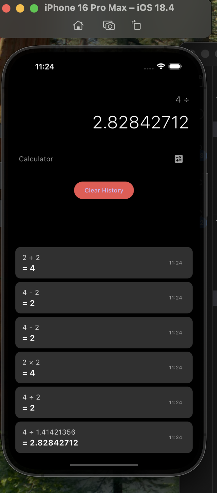

# calculator_app

# 📱 Flutter Calculator App

A sleek and functional calculator built with Flutter. Supports basic arithmetic operations with a beautiful and responsive UI.

---

---

## 📸 Screenshots



> Replace `calculator_screenshot.png` with your actual image name and make sure it's in the `assets/images/` folder.


## ✨ Features

- 🔢 Basic arithmetic operations: `+`, `-`, `×`, `÷`, `%` ,
- 🧼 Clear all & delete last entry
- 💡 Real-time expression and result display
- 📱 Responsive layout for all screen sizes

---

## 📸 Screenshots

> Add screenshots here (optional)

---

## 🚀 Getting Started

### Prerequisites

- [Flutter SDK](https://flutter.dev/docs/get-started/install)
- Dart SDK (comes with Flutter)
- An IDE like [VS Code](https://code.visualstudio.com/) or [Android Studio](https://developer.android.com/studio)

### Installation

1. Clone this repository:

```bash
git clone git@github.com:Douglasemmanuel/CALCULATOR-APP.git
cd flutter-calculator

2.  Open the Folder:
```bash

cd flutter-calculator


3. Get The Dependencies

  flutter pub get

4  Run The Flutter App
   flutter run


